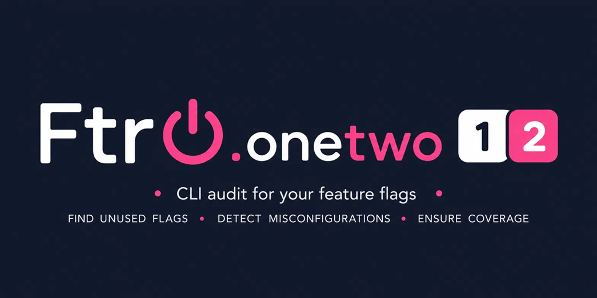

A .NET CLI tool that scans a project directory for [FtrIO](https://github.com/FtrOnOff/FtrIO) feature toggle usage and reports the current state of every toggle.

Because FtrIO always resolves toggle state from `appsettings.json` at runtime, FtrIO.onetwo gives you an instant at-a-glance view of exactly what is enabled or disabled in your codebase right now — and precisely where each toggle is used — without having to open a single source file or config manually.

## What it does

FtrIO.onetwo has three modes:

| Command | Purpose |
|---|---|
| `ftrio.onetwo` | Scan source code for toggle usage and report current state from `appsettings.json` |
| `ftrio.onetwo import` | Pull flag state from an external source (LaunchDarkly, Flagsmith, flagd, env vars, HTTP) into `appsettings.json` |
| `ftrio.onetwo migrate` | Scan for external SDK call sites, cross-reference against live flag state, generate a migration plan |

### Toggle detection

The default scan detects toggles from four patterns:

| Pattern | Use case |
|---|---|
| `[Toggle]` | Synchronous method gated by its own name |
| `[ToggleAsync]` | `Task`-returning method gated by its own name |
| `ExecuteMethodIfToggleOn(action, "key")` | Manual synchronous gating with an explicit key |
| `ExecuteMethodIfToggleOnAsync(func, "key")` | Manual async gating with an explicit key |

```csharp
// Attribute — toggle key is inferred from the method name
[Toggle]
public void SendWelcomeEmail() { }

[ToggleAsync]
public async Task SendNewsletterAsync() { }

// Manual call — toggle key is the string literal argument
featureToggle.ExecuteMethodIfToggleOn(ProcessOrder, "NewCheckoutFlow");
await featureToggle.ExecuteMethodIfToggleOnAsync(SyncDataAsync, "BetaSync");
```

## The FtrIO ecosystem

- [**FtrIO**](https://github.com/FtrOnOff/FtrIO) — the core library. Weaves `[Toggle]` into your IL at compile time, reads state from `appsettings.json` at runtime, and optionally syncs from remote sources via the provider pipeline.
- [**FtrIO.Toaster**](https://github.com/FtrOnOff/FtrIO.Toaster) — a lightweight web UI for managing toggles live. Writes values through `ToggleProviderBuffer` so changes flush to `appsettings.json` and are picked up instantly via `ReloadOnChange` — no file editing, no restart.
- [**FtrIO.onetwo**](https://github.com/FtrOnOff/FtrIO.onetwo) — a .NET CLI audit tool. Scans your source tree for every toggle reference, cross-references against `appsettings.json`, and reports each toggle's state (`ON` / `OFF` / `20%` / `BLUE` / `MISSING`) with file and line number.

## Requirements

- [.NET SDK](https://dotnet.microsoft.com/download) 6, 8, or 10 (net6.0, net8.0, and net10.0 are all supported)

## Installation

Install as a global dotnet tool from NuGet:

```bash
dotnet tool install -g FtrIO.onetwo
```

## Usage

```
ftrio.onetwo [--source <path>] [--config <path>] [--env <name>] [--markdown <output.md>]
```

| Argument | Description |
|---|---|
| `--source <path>` | Directory to scan for toggle usage in `.cs` files. Defaults to the current directory. |
| `--config <path>` | Directory to search for `appsettings*.json` files. Defaults to `--source` when not specified. |
| `--env <name>` | Show a single environment using the base+overlay model (e.g. `--env Staging`). Omit to show all `appsettings` files as separate tables. |
| `--markdown <file>` | Also write the results to a markdown file at the given path. |
| `--help` / `-h` | Show usage. |

`--source` and `--config` can also be passed as positional arguments — the first positional value is the source path, the second is the config path.

**Examples:**

```bash
# Scan a project — source and config in the same directory
ftrio.onetwo --source C:\Projects\MyApp

# Source code and config files in separate locations
ftrio.onetwo --source C:\Projects\MyApp --config C:\Projects\MyApp\bin\Debug\net10.0

# Positional shorthand (source then config)
ftrio.onetwo "C:\Projects\MyApp" "C:\Server\configs"

# Explicitly scan against the Staging overlay
ftrio.onetwo --source C:\Projects\MyApp --env Staging

# Also emit a markdown report
ftrio.onetwo --source C:\Projects\MyApp --config C:\Server\configs --env Production --markdown toggles.md

# Scan the current directory
ftrio.onetwo
```

## Example output

Without `--env`, each `appsettings*.json` file found is shown as a separate table:

```
Scanning C:\Projects\MyApp...

── Development C:\Projects\MyApp\appsettings.Development.json
╭──────────────────┬──────────────────┬──────────┬───────┬───────────────────┬──────╮
│ Toggle Key       │ Method           │ Source   │ State │ File              │ Line │
├──────────────────┼──────────────────┼──────────┼───────┼───────────────────┼──────┤
│ NewCheckoutFlow  │ NewCheckoutFlow  │ [Toggle] │  80%  │ Services\Order.cs │    9 │
│ SendWelcomeEmail │ SendWelcomeEmail │ [Toggle] │  ON   │ Services\Email.cs │   22 │
╰──────────────────┴──────────────────┴──────────┴───────┴───────────────────┴──────╯
2 toggle(s). 1 ON, 0 OFF, 1 PERCENTAGE, 0 BLUE/GREEN, 0 MISSING.

── appsettings.json C:\Projects\MyApp\appsettings.json
╭──────────────────┬──────────────────┬──────────┬─────────┬───────────────────┬──────╮
│ Toggle Key       │ Method           │ Source   │  State  │ File              │ Line │
├──────────────────┼──────────────────┼──────────┼─────────┼───────────────────┼──────┤
│ NewCheckoutFlow  │ NewCheckoutFlow  │ [Toggle] │   OFF   │ Services\Order.cs │    9 │
│ SendWelcomeEmail │ SendWelcomeEmail │ [Toggle] │   ON    │ Services\Email.cs │   22 │
╰──────────────────┴──────────────────┴──────────┴─────────┴───────────────────┴──────╯
2 toggle(s). 1 ON, 1 OFF, 0 PERCENTAGE, 0 BLUE/GREEN, 0 MISSING.

── Staging C:\Projects\MyApp\appsettings.Staging.json
╭──────────────────┬──────────────────┬────────────┬─────────┬───────────────────┬──────╮
│ Toggle Key       │ Method           │ Source     │  State  │ File              │ Line │
├──────────────────┼──────────────────┼────────────┼─────────┼───────────────────┼──────┤
│ NewCheckoutFlow  │ NewCheckoutFlow  │ [Toggle]   │   50%   │ Services\Order.cs │    9 │
│ PaymentV2        │ PaymentV2        │ [Toggle]   │  BLUE   │ Services\Pay.cs   │    6 │
│ SendWelcomeEmail │ SendWelcomeEmail │ [Toggle]   │   ON    │ Services\Email.cs │   22 │
│ UnknownFeature   │ UnknownFeature   │ ManualCall │ MISSING │ Controllers\Ho... │   42 │
╰──────────────────┴──────────────────┴────────────┴─────────┴───────────────────┴──────╯
4 toggle(s). 1 ON, 0 OFF, 1 PERCENTAGE, 1 BLUE/GREEN, 1 MISSING.
```

With `--env`, a single table is shown for that environment alongside its file path:

```
Scanning C:\Projects\MyApp...

── Staging C:\Projects\MyApp\appsettings.Staging.json
╭──────────────────┬──────────────────┬────────────┬─────────┬───────────────────┬──────╮
│ Toggle Key       │ Method           │ Source     │  State  │ File              │ Line │
├──────────────────┼──────────────────┼────────────┼─────────┼───────────────────┼──────┤
│ NewCheckoutFlow  │ NewCheckoutFlow  │ [Toggle]   │   50%   │ Services\Order.cs │    9 │
│ PaymentV2        │ PaymentV2        │ [Toggle]   │  BLUE   │ Services\Pay.cs   │    6 │
│ SendWelcomeEmail │ SendWelcomeEmail │ [Toggle]   │   ON    │ Services\Email.cs │   22 │
│ UnknownFeature   │ UnknownFeature   │ ManualCall │ MISSING │ Controllers\Ho... │   42 │
╰──────────────────┴──────────────────┴────────────┴─────────┴───────────────────┴──────╯
4 toggle(s). 1 ON, 0 OFF, 1 PERCENTAGE, 1 BLUE/GREEN, 1 MISSING.
```

## States

| State | Meaning |
|---|---|
| `ON` | Toggle is `true` or `1` in `appsettings.json` |
| `OFF` | Toggle is `false` or `0` in `appsettings.json` |
| `20%` | Percentage rollout — the raw value (e.g. `"20%"`) is shown directly |
| `BLUE` / `GREEN` | Blue-green deployment slot — shown in uppercase |
| `MISSING` | Toggle key is used in code but has no entry in any `appsettings*.json` file |

## Multi-environment support

### All environments (default)

When no `--env` flag is given, FtrIO.onetwo finds every `appsettings*.json` in the project tree and renders a separate table for each one. The environment name is derived from the filename — `appsettings.Staging.json` becomes `Staging`, and the base `appsettings.json` is shown verbatim. Each table header includes the full path to the file it was read from so there is never any ambiguity about which config is being shown.

Duplicate environment names are deduplicated — if the same name appears in both the source directory and `bin/`, the first one found wins.

### Targeting a specific environment

Use `--env` to read a single environment. FtrIO.onetwo applies FtrIO's overlay model: the environment-specific file's values win, and the base `appsettings.json` fills any gaps. The full path to the overlay file is shown in the table header.

```bash
ftrio.onetwo --source C:\Projects\MyApp --env Staging
ftrio.onetwo --source C:\Projects\MyApp --env Production
```

```json
// appsettings.json — base config
{
  "Toggles": {
    "SendWelcomeEmail": true,
    "NewCheckoutFlow": false,
    "PaymentV2": "blue"
  }
}

// appsettings.Staging.json — overlay (only differing values needed)
{
  "Toggles": {
    "NewCheckoutFlow": "50%"
  }
}
```

With this setup, `--env Staging` resolves `NewCheckoutFlow` to `50%` and fills `SendWelcomeEmail` and `PaymentV2` from the base.

> **Note:** FtrIO deliberately ignores `ASPNETCORE_ENVIRONMENT`, and so does this tool. Use `--env` on the command line to target a specific environment.

## Import — pull flags from an external source

`ftrio.onetwo import` fetches flag state from an external provider and writes it into the `Toggles` section of `appsettings.json` without touching anything else in the file. Designed as an escape hatch — run once to snapshot state, then migrate call sites at your own pace.

**Supported sources:** `launchdarkly`, `flagsmith`, `flagd`, `env`, `http`

| Argument | Description |
|---|---|
| `--source` | Source type (required): `launchdarkly`, `flagsmith`, `flagd`, `env`, `http` |
| `--api-key` | Auth key for LaunchDarkly or Flagsmith |
| `--project` | LaunchDarkly project key |
| `--env` | Environment name |
| `--url` | Endpoint URL for `http` source |
| `--file` | Local file path for `flagd` source |
| `--prefix` | Prefix to strip for `env` source (e.g. `FEATURE_`) |
| `--config` | Path to `appsettings.json` to write (default: `appsettings.json` in current directory) |
| `--dry-run` | Print what would change without writing anything |
| `--overwrite` | Replace the entire `Toggles` section (default: merge, preserving untouched keys) |
| `--markdown` | Also write a markdown summary to this file |
| `--sync` | Run continuously, polling on `--interval` seconds |
| `--interval` | Poll interval in seconds when using `--sync` (default: 30) |
| `--fail-on-warnings` | Exit code 3 if any flags were approximated |

**Flag normalisation:** external flag keys (`new-checkout-flow`) are automatically converted to PascalCase (`NewCheckoutFlow`) to match FtrIO's convention of using method names as toggle keys.

**State mapping (LaunchDarkly):**

| Flag type | Written value | Notes |
|---|---|---|
| Boolean, no targeting | `true` / `false` | Direct |
| Percentage rollout | `"20%"` | Direct |
| String, no targeting | Raw string | Direct |
| Boolean with targeting rules | Off-variation value | Approximated — warning emitted |
| Number flag | String of number | Approximated — warning emitted |
| JSON flag | Not written | Unsupported — warning emitted |

**Exit codes:** `0` success, `1` source unreachable/auth failure, `2` write failure, `3` warnings (only with `--fail-on-warnings`)

```bash
# LaunchDarkly — merge into appsettings.json
ftrio.onetwo import --source launchdarkly --api-key sdk-xxx --project my-project --env production --config C:\Projects\MyApp\appsettings.json

# Dry run — see what would change without writing
ftrio.onetwo import --source launchdarkly --api-key sdk-xxx --project my-project --env production --dry-run

# Flagsmith
ftrio.onetwo import --source flagsmith --api-key env-xxx --env production --config C:\Projects\MyApp\appsettings.json

# flagd local file
ftrio.onetwo import --source flagd --file C:\flags\flags.json --config C:\Projects\MyApp\appsettings.json

# Environment variables with prefix stripping
ftrio.onetwo import --source env --prefix FEATURE_ --config C:\Projects\MyApp\appsettings.json

# Continuous sync, polling every 60 seconds
ftrio.onetwo import --source launchdarkly --api-key sdk-xxx --project my-project --env production --sync --interval 60
```

---

## Migrate — analyse and plan migration from an external SDK

`ftrio.onetwo migrate` scans `.cs` files for LaunchDarkly or Flagsmith SDK call patterns using Roslyn, cross-references them against live flag state (if `--api-key` is provided), and generates a migration report. **It does not modify any code** — the developer does the work guided by the report.

| Argument | Description |
|---|---|
| `--from` | SDK to scan for (required): `launchdarkly`, `flagsmith` |
| `--source` | Directory to scan for `.cs` files |
| `--api-key` | Optional — fetches live flag state from the API |
| `--project` | LaunchDarkly project key |
| `--env` | Environment name |
| `--config` | Directory containing `appsettings.json` |
| `--markdown` | Write the full report to a markdown file |
| `--exclude` | Comma-separated flag keys to exclude from the report |
| `--fail-on-unsupported` | Exit code 1 if any unsupported flags are found |

**SDK patterns detected:**

```csharp
// LaunchDarkly
client.BoolVariation("flag-key", user, false)
client.StringVariation("flag-key", user, "default")
client.IntVariation("flag-key", user, 0)
client.JsonVariation("flag-key", user, defaultValue)

// Flagsmith
flagsmithClient.HasFeatureFlagAsync("flag-key")
flagsmithClient.GetFeatureFlagValueAsync("flag-key")
```

**Report categories:**

| Status | Meaning |
|---|---|
| ✅ Ready to migrate | Boolean flag, no targeting rules — straightforward `[Toggle]` replacement |
| ⚠️ Needs review | Targeting rules, number flags, or no API key provided |
| ❌ Cannot migrate | JSON flags — recommend moving to `IConfiguration` options pattern |
| Stale flag | In API but not referenced in code — safe to delete from the provider |
| Deleted flag | Referenced in code but no longer exists in the API — potentially broken |

For each **ready to migrate** flag the report shows the suggested refactor: extract the toggled block into a parent method named after the flag key, decorate it with `[Toggle]`, and add the key to `appsettings.json`.

```bash
# Full migration report with live flag state
ftrio.onetwo migrate --from launchdarkly --api-key sdk-xxx --project my-project --env production --source C:\Projects\MyApp --markdown plan.md

# Code scan only — no API key required
ftrio.onetwo migrate --from launchdarkly --source C:\Projects\MyApp

# Flagsmith
ftrio.onetwo migrate --from flagsmith --api-key env-xxx --source C:\Projects\MyApp --markdown plan.md
```

---

## End-to-end migration workflow

```bash
# 1. Generate the migration plan
ftrio.onetwo migrate --from launchdarkly --api-key sdk-xxx --project my-project --env production --source C:\Projects\MyApp --markdown plan.md

# 2. Review plan.md with the team

# 3. Snapshot current flag state into appsettings.json
ftrio.onetwo import --source launchdarkly --api-key sdk-xxx --project my-project --env production --config C:\Projects\MyApp\appsettings.json

# 4. Verify the snapshot
ftrio.onetwo --source C:\Projects\MyApp

# 5. Migrate call sites guided by plan.md

# 6. Verify toggles are all wired up correctly
ftrio.onetwo --source C:\Projects\MyApp
```

---

## Deployment safety

FtrIO.onetwo provides a two-command deployment gate that ensures your production config always has an entry for every toggle your code uses — before you deploy, not after.

### `ftrio.onetwo export-manifest`

Scans your source tree and writes a JSON manifest of every toggle key the codebase references, with its source type, file path, and line number. Run this in your app's CI pipeline on every push.

```bash
ftrio.onetwo export-manifest --source ./src --output toggles.manifest.json
```

```json
{
  "generatedAt": "2026-06-21T16:00:00Z",
  "toggles": [
    { "key": "SendWelcomeEmail", "source": "[Toggle]", "file": "Services/EmailService.cs", "line": 17 },
    { "key": "PaymentV2", "source": "[ToggleAsync]", "file": "Services/PaymentService.cs", "line": 88 }
  ]
}
```

| Argument | Description |
|---|---|
| `--source <path>` | Directory to scan for `.cs` files. Defaults to current directory. |
| `--output <file>` | Path to write the manifest. Defaults to `toggles.manifest.json`. |
| `--pretty` | Pretty-print the JSON output (default: true). |

**Exit codes:** `0` success, `1` source not found or no `.cs` files, `2` write failure

---

### `ftrio.onetwo release-check`

Reads a manifest and validates every key is present in a target `appsettings.json` — either a local file or a remote URL. Blocks the release if anything is missing.

```bash
ftrio.onetwo release-check \
  --manifest toggles.manifest.json \
  --config appsettings.Production.json \
  --env-name Production \
  --markdown release-check-report.md
```

```
FtrIO release check: Production
Manifest:  toggles.manifest.json (2 toggles)
Config:    appsettings.Production.json

✅  SendWelcomeEmail    present   true
❌  PaymentV2           MISSING
    Used at:    Services\PaymentService.cs:88
    Risk:       Toggle key not in config — will be treated as OFF at runtime
    Suggested:  "PaymentV2": "false"

── Add to appsettings.json ──────────────────────────
{
  "Toggles": {
    "PaymentV2": "false"
  }
}

── Summary ──────────────────────────────────────────
1 present ✅   1 missing ❌
Release to Production is BLOCKED.
```

| Argument | Description |
|---|---|
| `--manifest <file>` | Path to the manifest JSON. Required. |
| `--config <file>` | Path to a local `appsettings.json` to validate against. |
| `--config-url <url>` | URL to fetch the target config from. Mutually exclusive with `--config`. |
| `--env-name <name>` | Display name for the environment in the report. Defaults to the config filename. |
| `--markdown <file>` | Write the full report to a markdown file. |
| `--fail-on-missing` | Exit code 1 if any keys are missing (default: true). |
| `--warn-only` | Always exit 0 but emit warnings for missing keys. |

**Exit codes:** `0` all present, `1` keys missing, `2` manifest not found/invalid, `3` config unreachable

---

### GitHub Actions

Two companion actions are available to wire this into your pipelines.

**Step 1 — in your app's CI pipeline:**

```yaml
- uses: FtrOnOff/export-manifest-action@v1
  with:
    source: ./src
    output: toggles.manifest.json
```

The manifest is uploaded as a build artifact and retained for 30 days.

**Step 2 — in your deployment pipeline:**

```yaml
- uses: FtrOnOff/release-check-action@v1
  with:
    artifact-name: toggle-manifest
    config-url: ${{ secrets.PRODUCTION_CONFIG_URL }}
    config-auth-header: ${{ secrets.PRODUCTION_CONFIG_AUTH }}
    env-name: Production
    fail-on-missing: true
```

Missing keys emit warning annotations in the Actions UI and a single error summary when the check fails. The `deploy` job should declare `needs: release-check` so it is blocked automatically if the check fails.

**Full deployment pipeline:**

```yaml
name: Deploy to Production
on:
  release:
    types: [published]

jobs:
  release-check:
    runs-on: ubuntu-latest
    steps:
      - uses: FtrOnOff/release-check-action@v1
        with:
          artifact-name: toggle-manifest
          config-url: ${{ secrets.PRODUCTION_CONFIG_URL }}
          config-auth-header: ${{ secrets.PRODUCTION_CONFIG_AUTH }}
          env-name: Production
          fail-on-missing: true
          markdown: release-check-report.md

  deploy:
    needs: release-check
    runs-on: ubuntu-latest
    steps:
      - name: Deploy
        run: echo "deploying..."
```

Combined with the Roslyn-based toggle scanner (audit-time) and FtrIO itself (runtime), this catches missing toggle config at every stage of the pipeline.

---

## Building from source

```bash
cd FtrIO.onetwo
dotnet build
dotnet run -- --source <path>
dotnet run -- --source <source-path> --config <config-path>
```

## Related

- [FtrIO](https://github.com/FtrOnOff/FtrIO) — the feature toggle library this tool supplements
